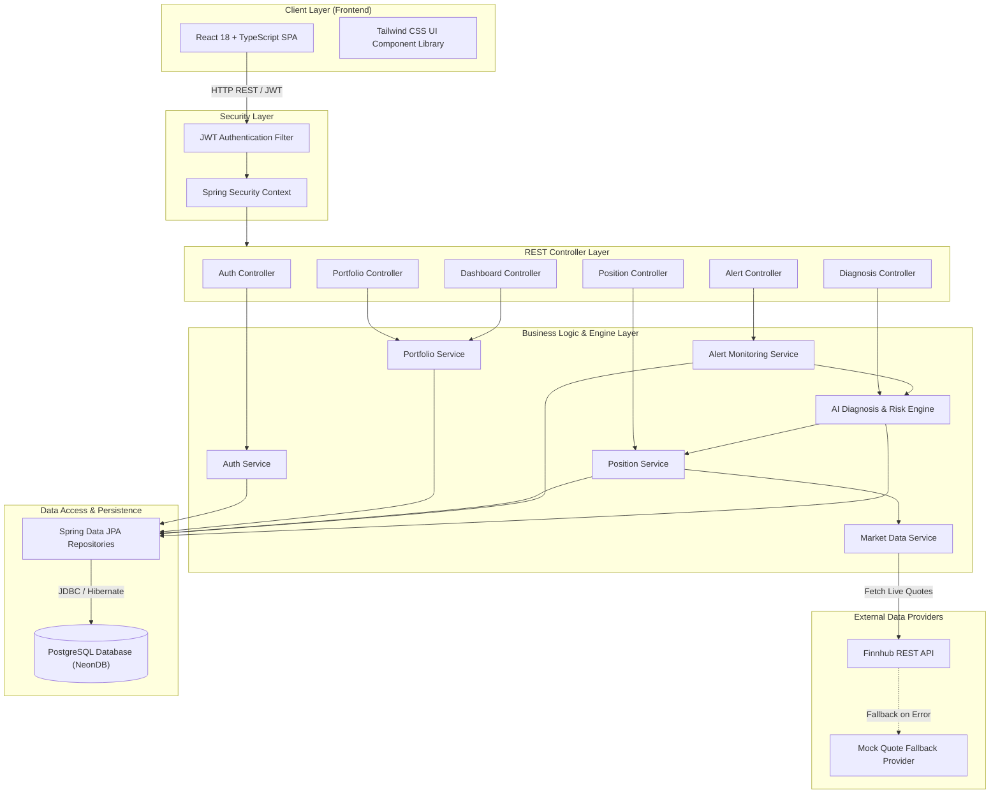

# <p align="center">🩺 Position Doctor</p>
<h3 align="center">AI-Powered Stock Portfolio & Position Risk Analyzer</h3>

<p align="center">
  <em>An enterprise-grade, intelligent portfolio management platform that helps investors monitor stock positions, evaluate portfolio health, diagnose investment risks, generate automated AI trade recommendations, and track market movements in real time.</em>
</p>

<p align="center">
  <a href="https://java.com"></a>
  <a href="https://spring.io/projects/spring-boot"></a>
  <a href="https://reactjs.org"></a>
  <a href="https://typescriptlang.org"></a>
  <a href="https://tailwindcss.com"></a>
  <a href="https://vitejs.dev"></a>
  <a href="https://postgresql.org"></a>
  <a href="https://jwt.io"></a>
  <a href="https://maven.apache.org"></a>
  <a href="LICENSE"></a>
</p>

---

## 📌 Table of Contents
- [Project Description](#-project-description)
- [Major Features](#-major-features)
- [System Architecture](#-system-architecture)
- [Technology Stack](#-technology-stack)
- [Folder Structure](#-folder-structure)
- [Installation & Setup](#-installation--setup)
- [Environment Variables](#-environment-variables)
- [API Endpoints](#-api-endpoints)
- [Screenshots](#-screenshots)
- [Future Enhancements](#-future-enhancements)
- [Testing](#-testing)
- [Security](#-security)
- [Performance & Optimization](#-performance--optimization)
- [Contributing](#-contributing)
- [License](#-license)
- [Author](#-author)

---

## 📖 Project Description

**Position Doctor** is a full-stack, AI-powered fintech platform designed to empower retail and professional investors with real-time portfolio risk diagnostics and actionable trade recommendations. Managing complex stock portfolios often leads to cognitive overload, delayed reaction times during market shifts, and emotional decision-making. Position Doctor solves this problem by continuously assessing stock positions against quantitative risk metrics, dynamic price fluctuations, and intelligent decision heuristics.

The system calculates an **Overall Portfolio Health Score (0-100)**, identifies drawdown vulnerabilities, flags stop-loss breaches, and generates real-time recommendations (such as `HOLD`, `ADD`, `BOOK_PROFIT`, `EXIT`, and `TIGHTEN_STOPLOSS`). With automated 30-second live price updates powered by the Finnhub Market Data API (complete with a resilient Mock Data Provider fallback), investors receive instant alerts when market dynamics shift or recommendations change.

### 🌟 Project Status
- ✅ **Backend MVP Complete**: Full REST API implementation built with Spring Boot 3 & Java 17.
- ✅ **Frontend Dashboard Complete**: Modern responsive UI built with React, TypeScript & Tailwind CSS.
- ✅ **JWT Authentication Implemented**: Secure stateless user authorization & session management.
- ✅ **AI Diagnosis Engine Implemented**: Multi-factor quantitative risk scoring & decision generation.
- ✅ **Alert Engine Implemented**: Background monitoring with automated alerts on risk triggers.
- ✅ **Live Market Data Integrated**: Real-time ticker price fetcher with fallback resiliency.

---

## 🔥 Major Features

### 🔐 Authentication & Authorization
- **User Registration & Login**: Secure credential management with BCrypt password hashing.
- **Stateless JWT Security**: Token-based REST API authorization via `Bearer` access tokens.
- **Protected API Routes**: Dynamic method-level and URL-level role/user access controls.

### 💼 Portfolio Management
- **Portfolio Operations**: Full CRUD lifecycle (Create, Update, Delete, View Summary) for user portfolios.
- **Summary Metrics**: Aggregated total investment, total current value, un-realized P&L, overall risk level, and cumulative health score.

### 📈 Position Management
- **Position Tracking**: Add, edit, delete, and view individual stock holdings within a portfolio.
- **Position Metrics**: Track entry price, quantity, current market price, target price, stop loss, and current P&L percentage.

### ⚡ Live Market Data Engine
- **Finnhub Market Data API Integration**: Real-time quote polling for US market stock tickers.
- **30-Second Polling Scheduler**: Automated background service to fetch current market quotes periodically.
- **Resilient Mock Provider Fallback**: Automatic failover to synthetic quote generation if external API limits or network issues occur.

### 🧠 AI Diagnosis Engine
- **Health Score Calculation**: Dynamic scoring algorithm (0-100) combining gain/loss ratio, distance to stop-loss, drawdown, and position size weight.
- **Risk Assessment**: Categorizes positions into `LOW`, `MEDIUM`, `HIGH`, or `CRITICAL` risk tiers.
- **Automated Recommendation Engine**: Produces actionable signals:
  - 🟢 **`HOLD`**: Position is healthy within target strategy parameters.
  - 🔵 **`ADD`**: Strong upward momentum or favorable risk-to-reward ratio.
  - 🟡 **`BOOK_PROFIT`**: Target price reached or overextended gains achieved.
  - 🔴 **`EXIT`**: Stop-loss breached or fundamentals deteriorated.
  - 🟠 **`TIGHTEN_STOPLOSS`**: High volatility or sharp drawdown approaching threshold.
- **Comprehensive Position Diagnostic Reports**: In-depth analytical breakdown for every individual stock holding.

### 📊 Interactive Dashboard
- **Portfolio Overview**: Visual snapshot of portfolio performance, total value, and health gauge.
- **AI Recommendation Highlights**: Real-time feed of active recommendations across all holdings.
- **Open Positions Table**: Sortable and filterable data grid displaying active stocks, live prices, P&L, and diagnostics.
- **Recent Alert Center**: Instant view of high-priority risk updates and health score shifts.

### 🔔 Alert Engine
- **Background Alert Monitoring**: Continuous scanning of health score anomalies and signal changes.
- **Score & Signal Change Detection**: Fires instant alerts when position status transitions (e.g., `HOLD` ➔ `EXIT`).
- **Alert History**: Track read/unread alert notifications with full historical log.

---

## 🏗 System Architecture

Position Doctor follows a **Clean Layered Architecture** with strict separation of concerns, asynchronously driven market updates, and scheduled background risk evaluation.



---

## 🛠 Technology Stack

| Category | Technology | Description |
| :--- | :--- | :--- |
| **Backend Framework** | **Spring Boot 3.x** | Enterprise Java application framework |
| **Language** | **Java 17** | Modern LTS Java runtime environment |
| **Frontend Library** | **React 18** | Component-based UI rendering framework |
| **Frontend Language** | **TypeScript 5** | Strongly typed JavaScript superset |
| **Build System (FE)** | **Vite 5** | Next-generation fast frontend tooling |
| **Styling** | **Tailwind CSS 3** | Utility-first responsive CSS framework |
| **Database** | **PostgreSQL (NeonDB)** | Serverless cloud-hosted relational database |
| **Persistence** | **Spring Data JPA** | Object-Relational Mapping (ORM) via Hibernate |
| **Security** | **Spring Security + JWT** | Stateless token-based REST security |
| **Market Data** | **Finnhub REST API** | Financial market data provider |
| **Build Tool (BE)** | **Apache Maven** | Backend dependency and build lifecycle manager |
| **API Documentation**| **Swagger / OpenAPI 3**| Interactive REST API documentation UI |
| **Testing** | **JUnit 5 & Mockito** | Unit and integration testing frameworks |

---

## 📂 Folder Structure

```text
position-doctor-project/
├── .mvn/                         # Maven Wrapper files
├── pom.xml                       # Backend dependencies & build configuration
├── README.md                     # Project documentation
├── docs/                         # Project screenshots & media assets
│   └── images/
│       ├── login.png
│       ├── dashboard.png
│       ├── portfolio.png
│       ├── diagnosis.png
│       └── alerts.png
├── src/                          # Backend Source Code (Spring Boot)
│   ├── main/
│   │   ├── java/com/vishakha/position_doctor_project/
│   │   │   ├── PositionDoctorProjectApplication.java  # Main Application Bootstrapper
│   │   │   ├── common/                               # Base Exceptions & Global Response DTOs
│   │   │   │   ├── dto/
│   │   │   │   └── exception/
│   │   │   ├── config/                               # Security, Swagger, App & CORS Configurations
│   │   │   ├── domain/                               # Domain-Driven Modules
│   │   │   │   ├── alert/                            # Alert Engine (Controller, Service, Repository, Entity)
│   │   │   │   ├── auth/                             # Auth Module (Controller, Service, JWT logic)
│   │   │   │   ├── dashboard/                        # Dashboard Aggregator Controllers & Services
│   │   │   │   ├── diagnostic/                       # AI Risk Scoring Engine & Recommendation Handlers
│   │   │   │   ├── marketdata/                       # Finnhub API Client & Scheduled Refresh Jobs
│   │   │   │   ├── portfolio/                        # Portfolio Management Domain
│   │   │   │   ├── portfoliohistory/                 # Performance Tracking & Analytics History
│   │   │   │   ├── position/                         # Stock Position Domain & DTOs
│   │   │   │   └── user/                             # User Profile & Management Domain
│   │   │   └── security/                             # Custom JWT Filters & Authentication Entrypoints
│   │   └── resources/
│   │       ├── application.properties            # Environment & database configurations
│   │       └── schema-risklevel-update.sql       # Database schema initialization scripts
│   └── test/                                     # Unit & Integration Tests (JUnit5 / Mockito)
└── frontend/                     # Frontend Source Code (React + TypeScript)
    ├── index.html                # HTML entrypoint
    ├── package.json              # Frontend scripts & dependencies
    ├── vite.config.ts            # Vite build configuration
    ├── tailwind.config.js        # Tailwind styling system setup
    └── src/
        ├── App.tsx               # Root Component & Router Configuration
        ├── main.tsx              # Application Mounting & Global Context Providers
        ├── components/           # Shared UI Components (Navbar, Sidebar, Cards, Modals)
        ├── context/              # Authentication & Global State Context
        ├── features/             # Feature-based Modules
        │   ├── auth/             # Login & Register views
        │   ├── dashboard/        # Main Investor Dashboard UI
        │   ├── portfolio/        # Portfolio Manager & Position Modals
        │   ├── diagnosis/        # AI Diagnostic Reports & Recommendations View
        │   └── alerts/           # Alert Center Component
        ├── services/             # Axios API Clients & Endpoints
        └── types/                # TypeScript Interfaces & Models
```

---

## 🚀 Installation & Setup

Follow these steps to set up and run Position Doctor locally on your system.

### 📋 Prerequisites
Ensure you have the following software installed:
- **Java JDK 17** or higher
- **Node.js v18.x** or higher
- **npm v9.x** or higher
- **Git**

---

### 1️⃣ Clone the Repository
```bash
git clone https://github.com/vishch1/position-doctor-project.git
cd position-doctor-project
```

---

### 2️⃣ Configure Backend Settings

Modify `src/main/resources/application.properties` or set your environment variables accordingly:

```properties
# Server Configuration
server.port=8080

# Database Configuration (NeonDB or Local PostgreSQL)
spring.datasource.url=jdbc:postgresql://<YOUR_DATABASE_HOST>/neondb?sslmode=require
spring.datasource.username=<YOUR_DATABASE_USERNAME>
spring.datasource.password=<YOUR_DATABASE_PASSWORD>

# JWT Security
app.security.jwt-secret=yourSuperSecretKeyForJWTTokenGenerationMinimum32CharsLong
app.security.jwt-expiration-ms=86400000

# Market Data API
app.market-data.provider=finnhub
app.market-data.finnhub.api-key=<YOUR_FINNHUB_API_KEY>
```

---

### 3️⃣ Run Backend Application

Using the included Maven Wrapper:

```bash
# Clean and compile the backend
./mvnw clean install

# Run Spring Boot application
./mvnw spring-boot:run
```
The backend server will launch at `http://localhost:8080`.

---

### 4️⃣ Install & Run Frontend Application

Open a new terminal tab and navigate to the `frontend` folder:

```bash
cd frontend

# Install node dependencies
npm install

# Start Vite development server
npm run dev
```
The application UI will launch at `http://localhost:5173`.

---

## 🌐 Environment Variables

| Variable Name | Description | Default Value | Required |
| :--- | :--- | :--- | :---: |
| `SPRING_DATASOURCE_URL` | PostgreSQL JDBC connection URL | `jdbc:postgresql://...` | Yes |
| `SPRING_DATASOURCE_USERNAME` | Database user account | `neondb_owner` | Yes |
| `SPRING_DATASOURCE_PASSWORD` | Database password | `******` | Yes |
| `JWT_SECRET` | Secret key used to sign & verify JWT tokens | *Default secret key* | Yes |
| `JWT_EXPIRATION_MS` | Validity period of JWT token (in ms) | `86400000` (24 Hours) | No |
| `FINNHUB_API_KEY` | API Key for Finnhub Market Data Provider | *Empty (Triggers Mock)* | Optional |
| `FINNHUB_BASE_URL` | Finnhub REST API base endpoint | `https://finnhub.io/api/v1` | No |
| `MARKET_DATA_PROVIDER` | Active provider implementation (`finnhub` / `mock`)| `finnhub` | No |

---

## 🔌 API Endpoints

Position Doctor provides a complete RESTful API suite documented with Swagger / OpenAPI. Once the backend is running, access Swagger UI at:  
👉 `http://localhost:8080/swagger-ui.html`

### 🔑 Authentication API (`/api/v1/auth`)
| Method | Endpoint | Description | Auth Required |
| :--- | :--- | :--- | :---: |
| `POST` | `/api/v1/auth/register` | Register a new investor account | ❌ No |
| `POST` | `/api/v1/auth/login` | Authenticate user and receive JWT token | ❌ No |
| `GET` | `/api/v1/auth/me` | Fetch currently authenticated user profile | ✅ Yes |

### 👤 User API (`/api/v1/users`)
| Method | Endpoint | Description | Auth Required |
| :--- | :--- | :--- | :---: |
| `GET` | `/api/v1/users` | Retrieve all registered users (Admin) | ✅ Yes |
| `GET` | `/api/v1/users/{id}` | Get user details by ID | ✅ Yes |
| `PUT` | `/api/v1/users/{id}` | Update user details | ✅ Yes |
| `DELETE` | `/api/v1/users/{id}` | Delete user account | ✅ Yes |

### 💼 Portfolio API (`/api/v1/portfolios`)
| Method | Endpoint | Description | Auth Required |
| :--- | :--- | :--- | :---: |
| `POST` | `/api/v1/portfolios` | Create a new portfolio | ✅ Yes |
| `GET` | `/api/v1/portfolios` | List all portfolios | ✅ Yes |
| `GET` | `/api/v1/portfolios/{id}` | Get specific portfolio details | ✅ Yes |
| `PUT` | `/api/v1/portfolios/{id}` | Update portfolio details | ✅ Yes |
| `DELETE` | `/api/v1/portfolios/{id}` | Delete portfolio | ✅ Yes |

### 📈 Position API (`/api/v1/positions`)
| Method | Endpoint | Description | Auth Required |
| :--- | :--- | :--- | :---: |
| `POST` | `/api/v1/positions` | Add a new stock position | ✅ Yes |
| `GET` | `/api/v1/positions` | View all stock positions | ✅ Yes |
| `GET` | `/api/v1/positions/{id}` | Get position by ID | ✅ Yes |
| `GET` | `/api/v1/positions/portfolio/{portfolioId}` | Get all positions in a portfolio | ✅ Yes |
| `PUT` | `/api/v1/positions/{id}` | Edit stock position parameters | ✅ Yes |
| `DELETE` | `/api/v1/positions/{id}` | Remove position from portfolio | ✅ Yes |

### 📊 Dashboard & Analytics API (`/api/v1/dashboard`)
| Method | Endpoint | Description | Auth Required |
| :--- | :--- | :--- | :---: |
| `GET` | `/api/v1/dashboard` | Get overall dashboard metrics summary | ✅ Yes |
| `GET` | `/api/v1/history/{portfolioId}` | Retrieve portfolio historical performance | ✅ Yes |
| `GET` | `/api/v1/history/{portfolioId}/chart` | Get chart data points for visualization | ✅ Yes |

### 🧠 AI Diagnosis & Recommendations API (`/api/v1/diagnosis` & `/api/v1/recommendation`)
| Method | Endpoint | Description | Auth Required |
| :--- | :--- | :--- | :---: |
| `GET` | `/api/v1/diagnosis/{positionId}` | Generate AI Risk Diagnosis for a position | ✅ Yes |
| `GET` | `/api/v1/recommendation/{positionId}` | Fetch AI trade recommendation for position | ✅ Yes |

### 🔔 Alert API (`/api/v1/alerts`)
| Method | Endpoint | Description | Auth Required |
| :--- | :--- | :--- | :---: |
| `GET` | `/api/v1/alerts` | Get all system alerts | ✅ Yes |
| `GET` | `/api/v1/alerts/user/{userId}` | Get user-specific risk alerts | ✅ Yes |
| `PUT` | `/api/v1/alerts/{alertId}/read` | Mark alert notification as read | ✅ Yes |

### ⚙️ System & Health API (`/api/v1/system`)
| Method | Endpoint | Description | Auth Required |
| :--- | :--- | :--- | :---: |
| `GET` | `/api/v1/system/market-status` | Check market data engine status & provider | ✅ Yes |

---


---

## 🧪 Testing

Position Doctor emphasizes high code quality and software reliability. The backend includes automated unit and integration tests across Controllers, Services, Risk Engines, Market Data clients, and Security filters.

### Running Backend Tests
Execute unit and integration tests using Maven:

```bash
./mvnw test
```

### Test Coverage Highlights:
- **Unit Tests**: Isolated testing of domain logic using JUnit 5 & Mockito.
- **Service Tests**: Validation of portfolio calculations, position tracking, and alert triggers.
- **AI Risk Engine Tests**: Verification of health score algorithms, edge cases, stop-loss threshold triggers, and recommendation outputs (`HOLD`, `EXIT`, `BOOK_PROFIT`, etc.).
- **Authentication Tests**: Verification of JWT token creation, validation, password hashing, and unauthorized access rejections.
- **Market Data Tests**: Testing Finnhub client API integration and graceful fallback to Mock provider.

---

## 🔒 Security

Security is a primary design pillar in Position Doctor:

- **Stateless Authorization**: Built on Spring Security with JWT token-based authentication.
- **Password Security**: Passwords are encrypted using BCrypt strong hashing algorithm before storage.
- **Filter Chain Interception**: A custom `JwtAuthenticationFilter` intercepts incoming requests, validates tokens in the `Authorization` header, and populates the `SecurityContext`.
- **CORS Protection**: Explicit Cross-Origin Resource Sharing rules restrict access to authorized frontend origins.
- **Input Sanitization**: Request DTOs are validated using Jakarta Validation annotations (`@NotNull`, `@NotBlank`, `@Positive`) to prevent bad payload injection.

---

## ⚡ Performance & Optimization

- **Scheduled Background Refresh**: Market updates run via Spring `@Scheduled` tasks every 30 seconds, offloading data fetching from frontend client requests.
- **Optimized Batch Risk Calculation**: Risk engine evaluates positions in configurable batch sizes (`app.risk-engine.calculation-batch-size=100`) to maximize throughput.
- **JPA Repository Optimization**: Uses custom JPQL `@EntityGraph` and join fetch queries to prevent **N+1 select problems**.
- **Lazy Loading Management**: Entities utilize Hibernate lazy loading for collections, ensuring lightweight payload transfers.
- **Frontend State Caching**: Fast UI responsiveness powered by Vite asset bundler and optimized React state hooks.

---

## 🔮 Future Enhancements

- 📡 **Real-time WebSockets**: Push instant market price updates and risk alerts to the UI without polling.
- 📈 **Zerodha (Kite Connect) Integration**: One-click import and synchronization of live stock portfolios from Indian brokerages.
- 📊 **Advanced Portfolio Analytics**: Interactive Sharpe ratio, Beta, Alpha, Sector Allocation, and Maximum Drawdown visualizers.
- 🤖 **AI Chat Assistant**: Conversational AI assistant to ask natural language questions about portfolio risk.
- ✉️ **Multi-Channel Alerts**: Instant Email (SMTP/SendGrid) and SMS/WhatsApp (Twilio) alerts on critical stock drops.
- 📱 **Mobile Application**: Cross-platform mobile app built with React Native for iOS and Android.
- 🌐 **Multi-Broker Support**: Direct API integration with Interactive Brokers, Alpaca, and Upstox.

---

## 🤝 Contributing

Contributions are welcome and appreciated! To contribute:

1. **Fork the Repository**
2. **Create a Feature Branch**:
   ```bash
   git checkout -b feature/AmazingFeature
   ```
3. **Commit your Changes**:
   ```bash
   git commit -m "Add some AmazingFeature"
   ```
4. **Push to the Branch**:
   ```bash
   git push origin feature/AmazingFeature
   ```
5. **Open a Pull Request**

Please ensure all tests pass (`./mvnw test`) before submitting a PR.

---

## 📜 License

Distributed under the **MIT License**. See `LICENSE` for more details.

---

## 👤 Author

**Vishakha Chaudhary**

- **GitHub**: [@vishch1](https://github.com/vishch1)
- **LinkedIn**: [Vishakha Chaudhary](https://linkedin.com/in/vishakha-chaudhary)

---

<p align="center">
  Made with ❤️ by Vishakha Chaudhary | Position Doctor Platform
</p>
